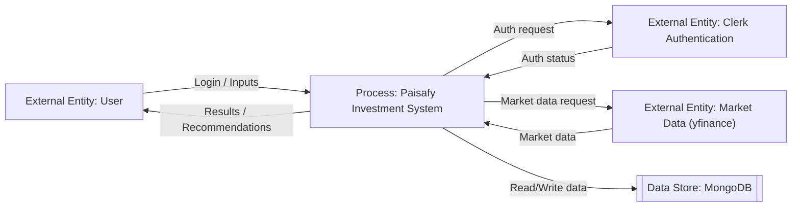
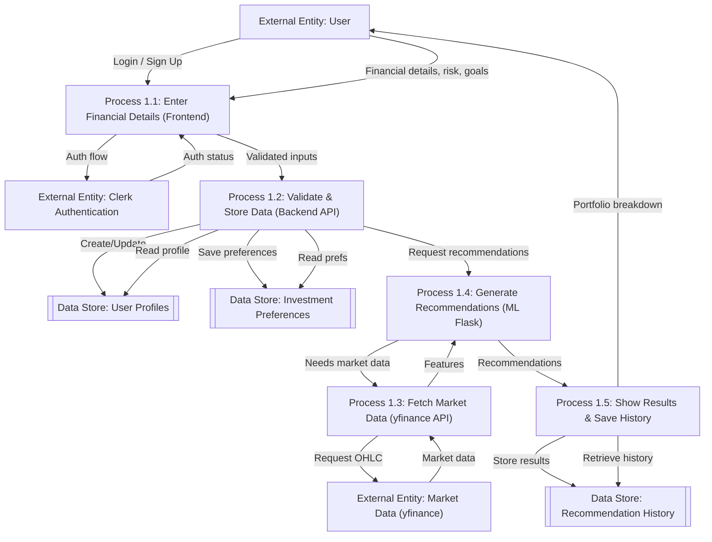

# Paisafy – Investment Recommendation System

## DFD Level 0 (Context Diagram)

```mermaid
flowchart LR
    U["External Entity: User"]
    A["External Entity: Clerk Authentication"]
    M["External Entity: Market Data (yfinance)"]
    P["Process: Paisafy Investment System"]
    D[["Data Store: MongoDB"]]

    U -->|Login / Inputs| P
    P -->|Auth request| A
    A -->|Auth status| P
    P -->|Market data request| M
    M -->|Market data| P
    P -->|Read/Write data| D
    P -->|Results / Recommendations| U
```

## DFD Level 1

```mermaid
flowchart TB
    U["External Entity: User"]
    A["External Entity: Clerk Authentication"]
    M["External Entity: Market Data (yfinance)"]

    D1[["Data Store: User Profiles"]]
    D2[["Data Store: Investment Preferences"]]
    D3[["Data Store: Recommendation History"]]

    P1["Process 1.1: Enter Financial Details (Frontend)"]
    P2["Process 1.2: Validate & Store Data (Backend API)"]
    P3["Process 1.3: Fetch Market Data (yfinance API)"]
    P4["Process 1.4: Generate Recommendations (ML Flask)"]
    P5["Process 1.5: Show Results & Save History"]

    U -->|Login / Sign Up| P1
    P1 -->|Auth flow| A
    A -->|Auth status| P1
    U -->|Financial details, risk, goals| P1
    P1 -->|Validated inputs| P2
    P2 -->|Create/Update| D1
    P2 -->|Save preferences| D2
    P2 -->|Read profile| D1
    P2 -->|Read prefs| D2
    P2 -->|Request recommendations| P4
    P4 -->|Needs market data| P3
    P3 -->|Request OHLC| M
    M -->|Market data| P3
    P3 -->|Features| P4
    P4 -->|Recommendations| P5
    P5 -->|Store results| D3
    P5 -->|Retrieve history| D3
    P5 -->|Portfolio breakdown| U
```
