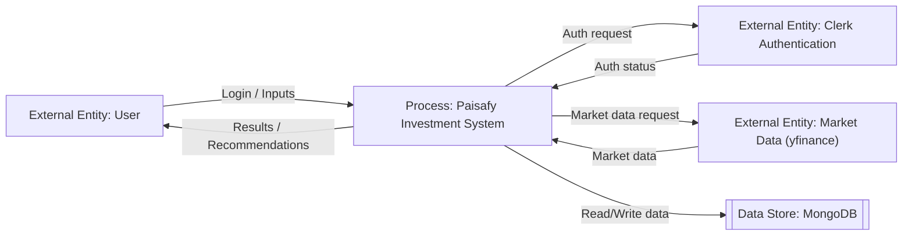
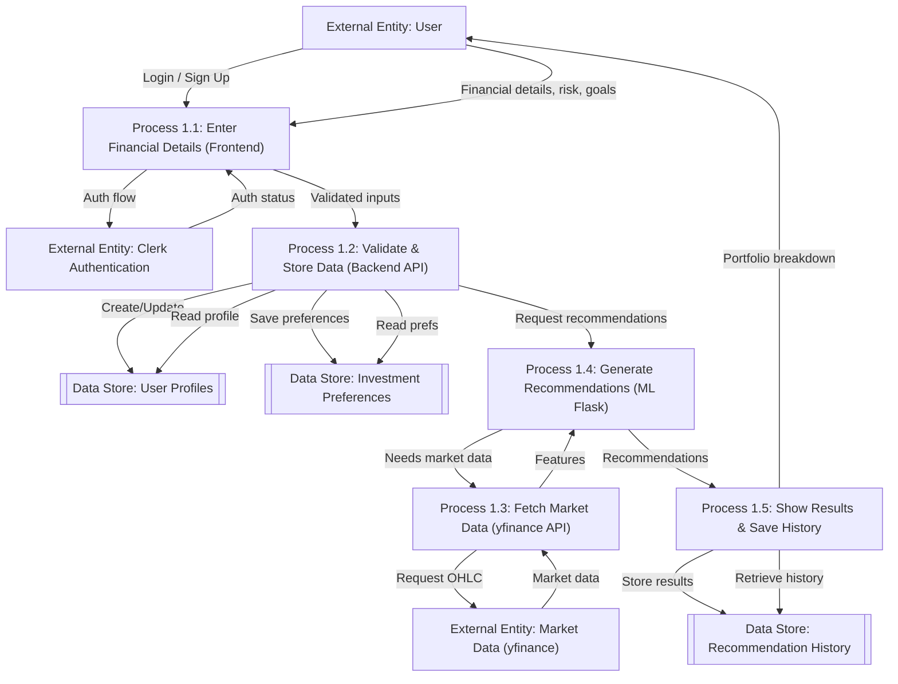

# Paisafy – Investment Recommendation System

Paisafy is a full-stack web application designed to provide personalized investment recommendations based on user profiles, risk appetites, goals, and market data. 

The application utilizes a combination of traditional backend services and a machine learning model to suggest optimized portfolio allocations spanning Stocks, ETFs, and Mutual Funds.

## 🚀 Tech Stack

### Frontend
- **React.js** (Vite)
- **TailwindCSS** for modern, responsive, and aesthetic UI
- **Clerk** for User Authentication
- **Framer Motion** & **Lucide React** for UI animations and icons
- **Axios** for API requests

### Backend (Node.js API)
- **Node.js** with **Express.js**
- **MongoDB** via **Mongoose** for data persistence (Users, Preferences, Recommendation History)
- **Clerk Express SDK** for backend route protection and auth validation

### Machine Learning / Python Server
- **Python** with **Flask**
- **scikit-learn** / **pandas** for ML model inference and training
- Uses historical and generated datasets to predict allocations
- Serves recommendations to the Node.js backend

---

## 🏗️ Architecture & Data Flow

### DFD Level 0 (Context Diagram)


### DFD Level 1


---

## 📂 Project Structure

```
paisafy/
├── frontend/             # React application (Vite + Tailwind)
│   ├── src/
│   │   ├── components/   # Reusable UI components
│   │   ├── pages/        # Main route pages (Home, Form)
│   │   └── ...
├── backend/              # Node.js + Express backend
│   ├── controllers/      # Business logic (users, recommendations)
│   ├── models/           # Mongoose schemas
│   ├── routes/           # Express route definitions
│   └── index.js          # Main server entrypoint
├── ml-server/            # Python Flask server for ML Inference
│   ├── models/           # Pre-trained ML models
│   ├── app.py            # Flask API entry point
│   ├── predict.py        # Prediction logic
│   └── train.py          # Model training scripts
└── readme.md             # Project documentation
```

---

## 🛠️ Installation & Local Setup

### Prerequisites
- Node.js (v18+)
- Python (3.9+)
- MongoDB connection string (Local or Atlas)
- Clerk API Keys (Publishable key and Secret key)

### 1. Backend Setup
```bash
cd backend
npm install
```
Create a `.env` file in the `backend/` directory:
```env
PORT=5000
MONGO_URI=your_mongodb_connection_string
CLERK_PUBLISHABLE_KEY=your_clerk_publishable_key
CLERK_SECRET_KEY=your_clerk_secret_key
FLASK_URL=http://127.0.0.1:8000
RAPIDAPI_KEY=your_rapidapi_key
```
Start the server:
```bash
npm run dev
```

### 2. Machine Learning Server Setup
```bash
cd ml-server
python -m venv venv
# Activate venv (Windows: venv\Scripts\activate | Mac/Linux: source venv/bin/activate)
pip install -r requirements.txt
```
Start the Flask server:
```bash
python app.py
```

### 3. Frontend Setup
```bash
cd frontend
npm install
```
Create a `.env` file in the `frontend/` directory:
```env
VITE_BACKEND_URL=http://localhost:5000
```
*(Note: Clerk publishable key is currently hardcoded in `main.jsx` for frontend configuration)*

Start the development server:
```bash
npm run dev
```

---

## ✨ Features
- **Secure Authentication**: Passwordless or social login utilizing Clerk.
- **Dynamic Risk Profiling**: Custom algorithms to assess user's financial standing and risk tolerance.
- **Intelligent Portfolio Allocation**: Python-based models split funds intelligently across different financial instruments.
- **Market Specifics**: Recommendations are tied to real-world sectors (IT, FMCG, Banking, etc.) and asset classes.
- **Historical Tracking**: Ability to save and review past generated investment plans.
- **Premium UI**: Fluid, glassmorphism-inspired interface with responsive micro-animations for an elevated user experience.
